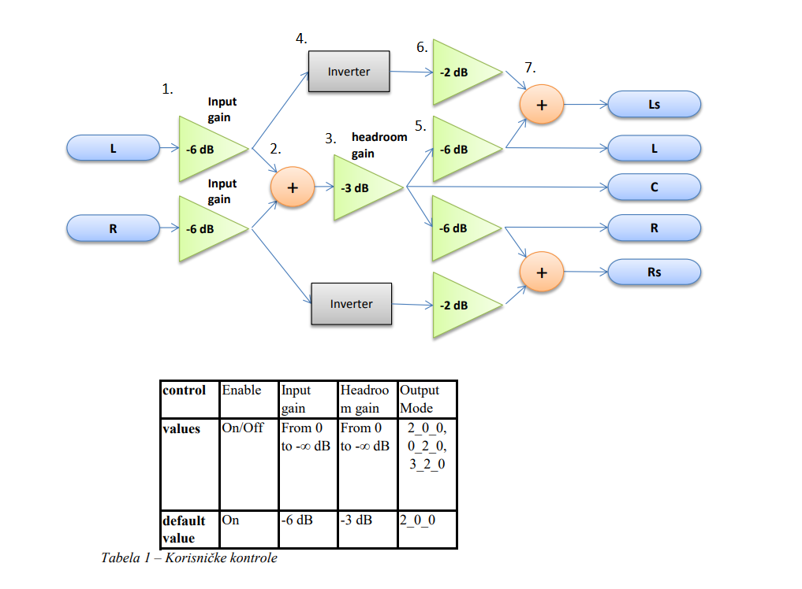
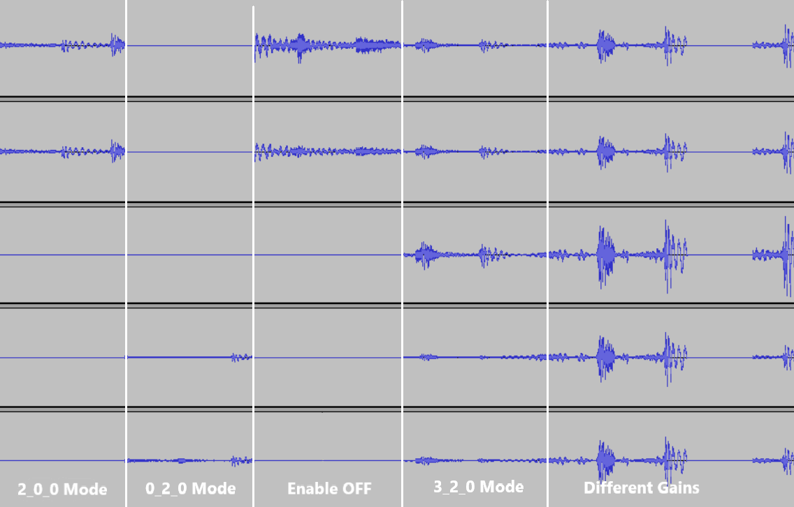

**REALIZATION OF CHANNEL COMBINING ALGORITHM ON THE CIRRUS LOGIC DSP PLATFORM**

The goal of the project is the realization of channel combining based on the given scheme and teble.
Visual Studio and CLIDE development environments were used for implementation.
C code is used, which is then adapted to the arithmetic of the Crystal DSP processor, and finally the assembler is used.

The solution was realized gradually, through models. 
#### Model 0
Reference C code in arithmetic floating point. Realized in Visual Studio, with x86 compiler, in C/C++ language. 
#### Model 1
Step in which the reference C code from Model 0 is functionally optimized. 
#### Model 2
Modifying the algorithm and C code for immovable data types with a comma, therefore, one switches from floating-point to fixed-point arithmetic. 
#### Model 3 - C code
Environment is swiched from the Visual Studio to CLIDE. The code is adapted to the C language from the C++ language. 
#### Model 3 - Assembly
The gainProcessing function is converted from C language to hand-written assembly code of the given platform. 
#### Model 3 - Optimization
The code is further optimized to reduce the number of cycles. 
#### Final Model
Integration into the environment, further optimization and verification, after which testing is carried out. 

